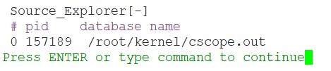
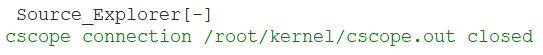
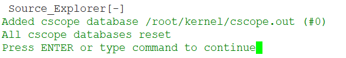
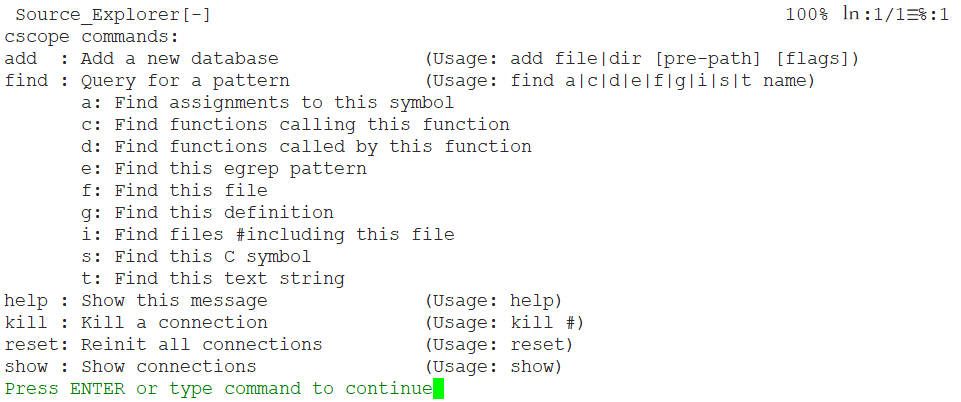

# cscope


## 基本介绍


* Cscope 是一款开源免费的 **C/C++** 浏览工具，自带一个基于文本的用户界面，通过cscope可以很方便地找到某个函数或变量的定义位置、被调用的位置等信息。
* Cscope对 **C/C++**支持较好，也可以自己定制来支持Java和Perl、Python等脚本语言。
* Vim和gvim都提供了cscope接口，通过适当的配置，可以在Unix/Linux下实现变量、函数、文件等之间跳转，就像Windows下的Source Insight一样灵活易用。

* 官网: <http://cscope.sourceforge.net/>


## 生成缓存

```
cscope -Rbq
```

* -R:为当前目录下所有子目录创建数据库
* -b:生成数据库之后不启动自带的查询界面
* -q:生成cscope.in.out和cscope.po.out，加快搜索速度


## cs find子命令

```
find : Query for a pattern            (Usage: find a|c|d|e|f|g|i|s|t name)
       a: Find assignments to this symbol
       c: Find functions calling this function
       d: Find functions called by this function
       e: Find this egrep pattern
       f: Find this file
       g: Find this definition
       i: Find files #including this file
       s: Find this C symbol
       t: Find this text string
```

基本命令格式：

```
：cs find t: ---- 查找指定的字符串
：cs find s ---- 查找C语言符号，即查找函数名、宏、枚举值等出现的地方
：cs find d ---- 查找本函数调用的函数
：cs find c ---- 查找调用本函数的函数


：cs find f ---- 查找并打开文件，类似vim的find功能

：cs find g ---- 查找函数、宏、枚举等定义的位置，类似ctags所提供的功能
：cs find e ---- 查找egrep模式，相当于egrep功能，但查找速度快多了
：cs find i ---- 查找包含本文件的文件
```

## 显示当前所用数据库（连接到cscope.out文件）

```
: cs show
```

* Show connections
* 显示当前连接
* cscope提供一组命令，可以在vim里面更换链接，就是可以更换不同的cscope.out文件




## 切换当前数据库（连接到另外cscope.out文件）


```
cs kill /root/kernel/cscope.out
cs add /root/kernel/cscope.out
```




## 初始化所有数据库连接

```
cs reset
```




## 显示简要帮助信息

```
:cs help
```

* 简短的cscope语法概要





## 参考

* <http://cscope.sourceforge.net/cscope_vim_tutorial.html>


---
