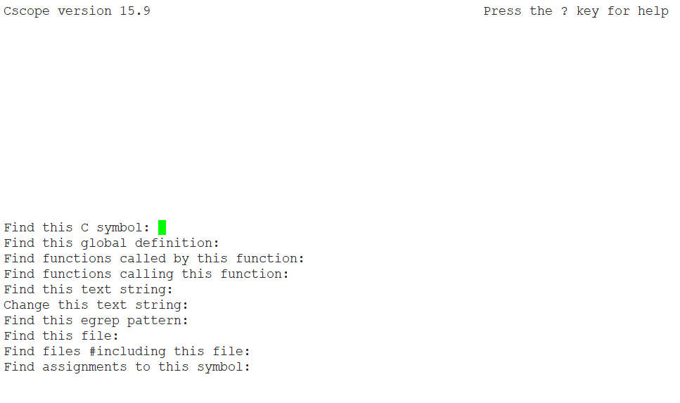

<!-- TOC -->

- [cscope](#cscope)
  - [基本介绍](#基本介绍)
  - [命令帮助信息](#命令帮助信息)
  - [交互模式](#交互模式)
  - [交互模式帮助信息](#交互模式帮助信息)
  - [生成缓存](#生成缓存)
  - [cs find子命令](#cs-find子命令)
  - [显示当前所用数据库（连接到cscope.out文件）](#显示当前所用数据库连接到cscopeout文件)
  - [切换当前数据库（连接到另外cscope.out文件）](#切换当前数据库连接到另外cscopeout文件)
  - [初始化所有数据库连接](#初始化所有数据库连接)
  - [显示简要帮助信息](#显示简要帮助信息)
  - [参考](#参考)

<!-- /TOC -->

# cscope


## 基本介绍


**C/C++ 代码检索工具**


* Cscope 是一款开源免费的 **C/C++** 浏览工具，自带一个基于文本的用户界面，通过cscope可以很方便地找到某个函数或变量的定义位置、被调用的位置等信息。
* Cscope对 **C/C++**支持较好，也可以自己定制来支持Java和Perl、Python等脚本语言。
* Vim和gvim都提供了cscope接口，通过适当的配置，可以在Unix/Linux下实现变量、函数、文件等之间跳转，就像Windows下的Source Insight一样灵活易用。
* 官网: <http://cscope.sourceforge.net/>


## 命令帮助信息

```
[root@rockylinux-ebpf ~/kernel]# cscope --help
Usage: cscope [-bcCdehklLqRTuUvV] [-f file] [-F file] [-i file] [-I dir] [-s dir]
              [-p number] [-P path] [-[0-8] pattern] [source files]

-b            Build the cross-reference only.
-C            Ignore letter case when searching.
-c            Use only ASCII characters in the cross-ref file (don't compress).
-d            Do not update the cross-reference.
-e            Suppress the <Ctrl>-e command prompt between files.
-F symfile    Read symbol reference lines from symfile.
-f reffile    Use reffile as cross-ref file name instead of cscope.out.
-h            This help screen.
-I incdir     Look in incdir for any #include files.
-i namefile   Browse through files listed in namefile, instead of cscope.files
-k            Kernel Mode - don't use /usr/include for #include files.
-L            Do a single search with line-oriented output.
-l            Line-oriented interface.
-num pattern  Go to input field num (counting from 0) and find pattern.
-P path       Prepend path to relative file names in pre-built cross-ref file.
-p n          Display the last n file path components.
-q            Build an inverted index for quick symbol searching.
-R            Recurse directories for files.
-s dir        Look in dir for additional source  files.
-T            Use only the first eight characters to match against C symbols.
-U            Check file time stamps.
-u            Unconditionally build the cross-reference file.
-v            Be more verbose in line mode.
-V            Print the version number.

Please see the manpage for more information.
```

## 交互模式

* 直接执行cscope不会进入交互模式，一般报错退出
* ctrl + d 可以退出交互界面, 结束查询
* 一般不会在交互模式玩耍，通常都是在vim上使用

```
cscope -d
```



## 交互模式帮助信息

```
Press the RETURN key repeatedly to move to the desired input field, type the
pattern to search for, and then press the RETURN key.  For the first 4 and
last 2 input fields, the pattern can be a regcomp(3) regular expression.
If the search is successful, you can use these single-character commands:

0-9a-zA-Z	Edit the file containing the displayed line.
space bar	Display next set of matching lines.
+               Display next set of matching lines.
^V              Display next set of matching lines.
-               Display previous set of matching lines.
^E              Edit all lines.
>               Write the list of lines being displayed to a file.
>>              Append the list of lines being displayed to a file.
<               Read lines from a file.
^               Filter all lines through a shell command.
|               Pipe all lines to a shell command.

At any time you can use these single-character commands:

TAB             Swap positions between input and output areas.
RETURN          Move to the next input field.
^N              Move to the next input field.
^P              Move to the previous input field.
^Y / ^A         Search with the last pattern typed.
^B              Recall previous input field and search pattern.
^F              Recall next input field and search pattern.
^C              Toggle ignore/use letter case when searching (USE).
^R              Rebuild the cross-reference.
!               Start an interactive shell (type ^D to return to cscope).
^L              Redraw the screen.
?               Display this list of commands.
^D              Exit cscope.

Note: If the first character of the pattern you want to search for matches
a command, type a \ character first.
Note: Some ctrl keys may be occupied by your terminal configuration.

```

## 生成缓存

```
cscope -Rbq
```

* -R:为当前目录下所有子目录创建数据库
* -b:生成数据库之后不启动自带的查询界面
* -q:生成cscope.in.out和cscope.po.out，加快搜索速度


## cs find子命令

```
find : Query for a pattern            (Usage: find a|c|d|e|f|g|i|s|t name)
       a: Find assignments to this symbol
       c: Find functions calling this function
       d: Find functions called by this function
       e: Find this egrep pattern
       f: Find this file
       g: Find this definition
       i: Find files #including this file
       s: Find this C symbol
       t: Find this text string
```

基本命令格式：

```
：cs find t: ---- 模糊搜索 指定的字符串
：cs find s ---- 查找C语言符号，即查找函数名、宏、枚举值等出现的地方
：cs find d ---- 查找 本函数 调用的函数
：cs find c ---- 查找 调用 本函数的函数


：cs find f ---- 查找并打开文件，类似vim的find功能

：cs find g ---- 查找函数、宏、枚举等定义的位置，类似ctags所提供的功能
：cs find e ---- 查找egrep模式，相当于egrep功能，但查找速度快多了
：cs find i ---- 查找包含本文件的文件
```

## 显示当前所用数据库（连接到cscope.out文件）

```
: cs show
```

* Show connections
* 显示当前连接
* cscope提供一组命令，可以在vim里面更换链接，就是可以更换不同的cscope.out文件


## 切换当前数据库（连接到另外cscope.out文件）


```
cs kill /root/kernel/cscope.out
cs add /root/kernel/cscope.out
```


## 初始化所有数据库连接

```
cs reset
```


## 显示简要帮助信息

```
:cs help
```

* 简短的cscope语法概要


## 参考

* <http://cscope.sourceforge.net/cscope_vim_tutorial.html>


---
